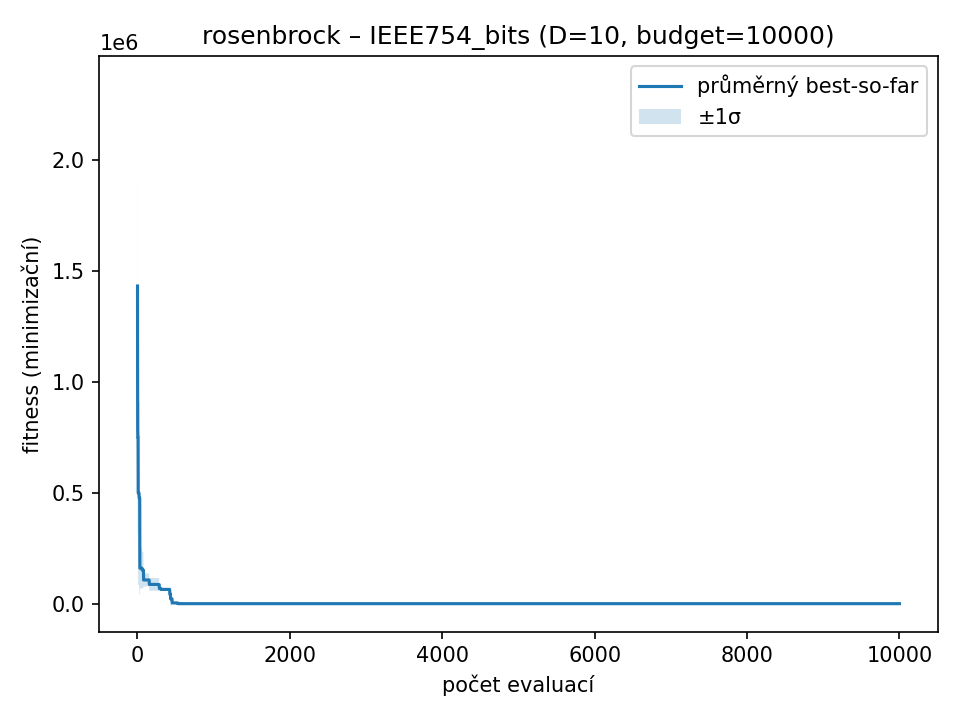
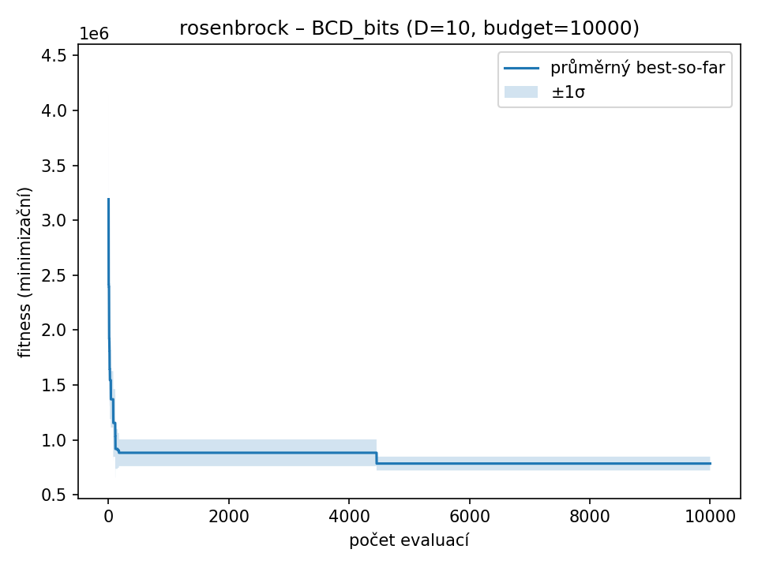
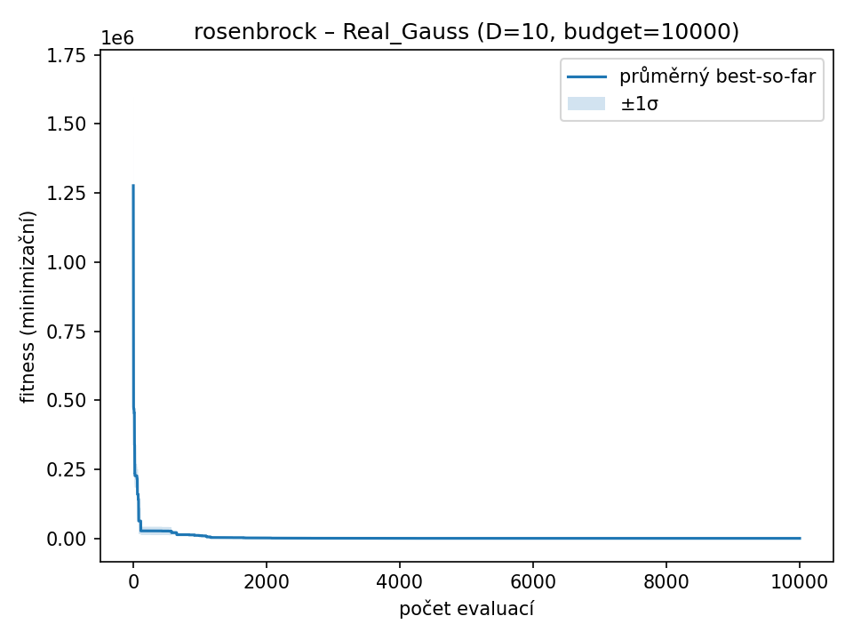
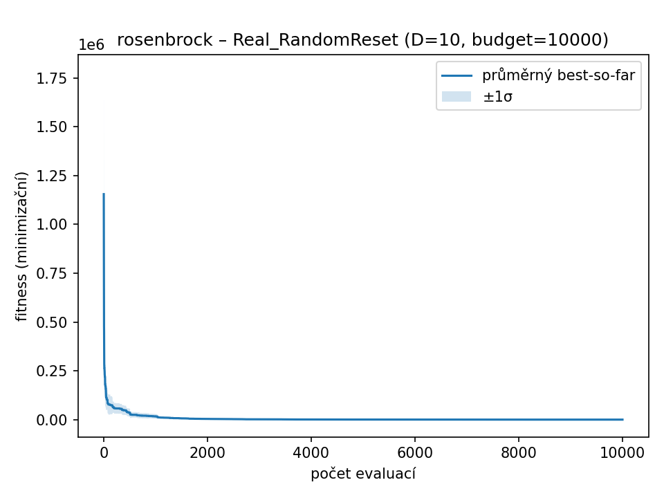

### rosenbrock – D=10, budget=10000, runs=3

| Varianta | best | worst | mean | median | std |
|-----------|-------|-------|------|--------|------|
| **IEEE754_bits** | **8.3410** | **8.8217** | **8.5037** | **8.3486** | **0.2248** |
| FixedPoint_bits | 628024.8758 | 742824.0000 | 688712.6507 | 695289.0763 | 47096.6861 |
| BCD_bits | 73.6250 | 296.1030 | 168.8436 | 136.8028 | 93.6094 |
| Real_Gauss | 7.2800 | 164.1191 | 60.6161 | 10.4493 | 73.1991 |
| Real_RandomReset | 44.0776 | 73.0190 | 59.1837 | 60.4544 | 11.8494 |

| IEEE754_bits | FixedPoint_bits | BCD_bits | Real_Gauss | Real_RandomReset |
| --- | --- | --- | --- | --- |
|  |  |  |  |  |
