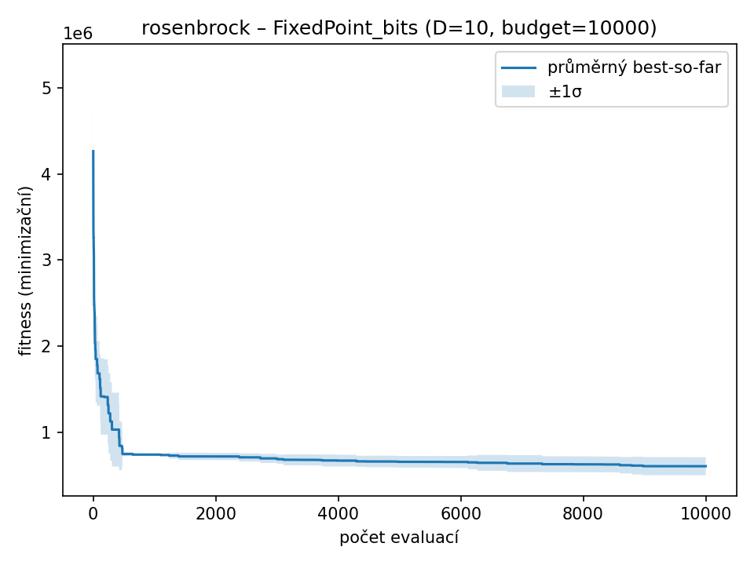

### rosenbrock – D=10, budget=10000, runs=3

| Varianta | best | worst | mean | median | std |
|----------|----------|-------|------|--------|-----|
| IEEE754_bits | 8.99098 | 75044 | 25020.7 | 9.02395 | 43321.5 |
| FixedPoint_bits | 810324 | 1.68787e+06 | 1.32035e+06 | 1.46287e+06 | 455801 |
| BCD_bits | 723350 | 848897 | 784489 | 781219 | 62837.7 |
| Real_Gauss | 32571.4 | 50811.5 | 40163.9 | 37108.9 | 9496.05 |
| Real_RandomReset | 24245.3 | 84339.3 | 52160.9 | 47898.2 | 30272.9 |

| IEEE754_bits | FixedPoint_bits | BCD_bits | Real_Gauss | Real_RandomReset |
| --- | --- | --- | --- | --- |
|  |  |  |  |  |
