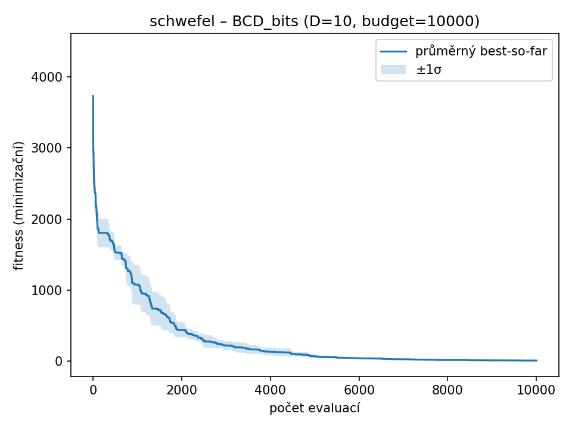

### schwefel – D=10, budget=10000, runs=3

| Varianta | best | worst | mean | median | std |
|----------|----------|-------|------|--------|-----|
| IEEE754_bits | 3106.29 | 3257.77 | 3156.87 | 3106.55 | 87.3797 |
| FixedPoint_bits | 2383.94 | 2745.12 | 2576.41 | 2600.19 | 181.759 |
| BCD_bits | 1853.28 | 2176.46 | 1965.64 | 1867.19 | 182.704 |
| Real_Gauss | 1646.16 | 2496.87 | 2179.12 | 2394.34 | 464.394 |
| Real_RandomReset | 2285.33 | 2706.83 | 2545.42 | 2644.1 | 227.416 |

| IEEE754_bits | FixedPoint_bits | BCD_bits | Real_Gauss | Real_RandomReset |
| --- | --- | --- | --- | --- |
|  |  |  |  |  |
