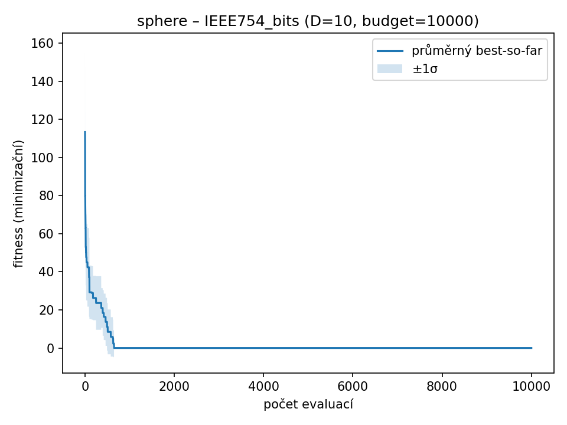

### sphere – D=10, budget=10000, runs=3

| Varianta | best | worst | mean | median | std |
|----------|----------|-------|------|--------|-----|
| IEEE754_bits | 26.2144 | 26.2144 | 26.2144 | 26.2144 | 2.1063e-08 |
| FixedPoint_bits | 235.93 | 237.413 | 236.425 | 235.934 | 0.855145 |
| BCD_bits | 52.5379 | 61.0808 | 56.7274 | 56.5636 | 4.27381 |
| Real_Gauss | 15.9932 | 35.0544 | 27.0945 | 30.236 | 9.91131 |
| Real_RandomReset | 26.1355 | 28.1922 | 27.167 | 27.1734 | 1.0284 |

| IEEE754_bits | FixedPoint_bits | BCD_bits | Real_Gauss | Real_RandomReset |
| --- | --- | --- | --- | --- |
|  |  |  |  |  |
