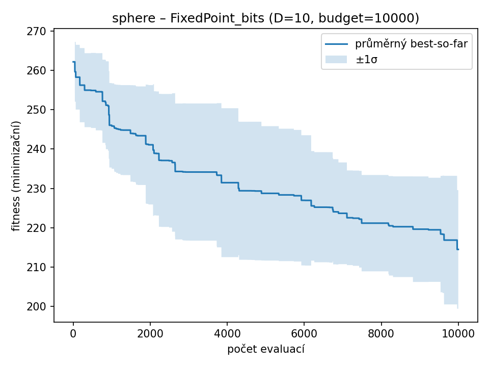

### sphere – D=10, budget=10000, runs=10

| Varianta | best | worst | mean | median | std |
|-----------|-------|-------|------|--------|------|
| **IEEE754_bits** | **0.0000** | **0.0000** | **0.0000** | **0.0000** | **0.0000** |
| FixedPoint_bits | 192.5742 | 235.9296 | 214.5038 | 209.7309 | 15.0625 |
| BCD_bits | 0.0113 | 0.2076 | 0.0645 | 0.0530 | 0.0535 |
| Real_Gauss | 0.0024 | 0.0155 | 0.0088 | 0.0083 | 0.0039 |
| Real_RandomReset | 0.0298 | 0.2568 | 0.1383 | 0.1278 | 0.0657 |

| IEEE754_bits | FixedPoint_bits | BCD_bits | Real_Gauss | Real_RandomReset |
| --- | --- | --- | --- | --- |
|  |  |  |  |  |
