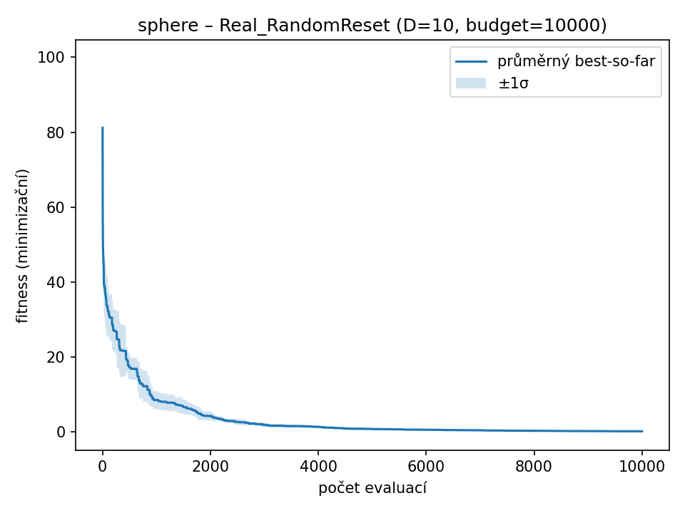
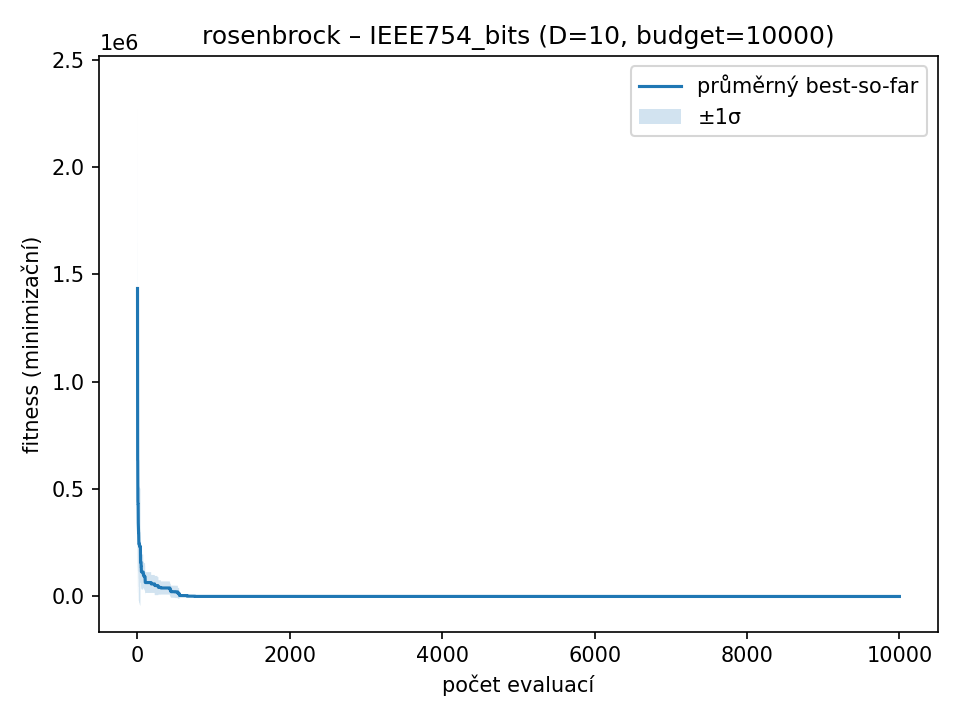
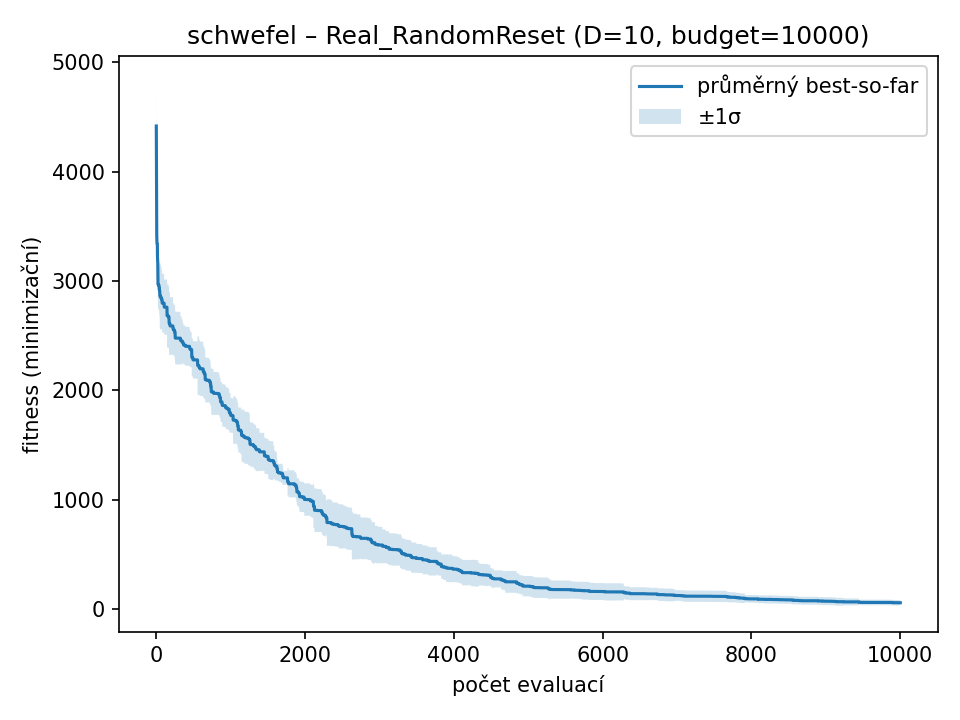

# Souhrnný report genetického algoritmu (GA)
**Datum generování:** 2025-10-14 16:41:02

## Nastavení experimentu

- RNG_SEED = `42`
- Počet běhů = `3`
- Dimenze (D) = `10`
- Počet evaluací (budget) = `10000`
- Velikost populace = `200`
- Elitismus = `10 %`

## Princip fungování GA

### Křížení (single-point crossover mezi dimenzemi)
Křížení probíhá mezi dvěma rodiči tak, že se náhodně zvolí **index dimenze (1 až D-1)**, na kterém se jejich vektory rozdělí. Potomci zdědí první část dimenzí od prvního rodiče a zbytek od druhého. Tento princip se používá jednotně pro všechny varianty, ale u bitových reprezentací se kříží celé 32bitové bloky.

### Mutace
- **Bitové varianty:** každý bit má pravděpodobnost `0.0312` že se přepne (0→1 nebo 1→0). Tím vzniká jemná náhodná změna binární reprezentace. Po mutaci se každý jedinec znovu dekóduje do reálných hodnot.
- **Reálné varianty:** každá dimenze má pravděpodobnost `0.1` na mutaci, přičemž se používají dvě metody:
  - **Gaussian mutace:** hodnota se posune o N(0, σ²), kde σ = 5.0% rozsahu proměnné. Zajišťuje jemné ladění řešení v lokálním okolí.
  - **RandomReset:** vybrané dimenze se nastaví na náhodnou hodnotu z celého intervalu. Podporuje globální průzkum prostoru a překonávání lokálních minim.

## Bitové reprezentace a jejich význam

### IEEE754
Každý jedinec je reprezentován jako 32bitová hodnota ve formátu IEEE 754 (1 bit znaménko, 8 bitů exponent, 23 bitů mantisa). Bity se interpretují přímo jako `float32` a následně se převádí pomocí funkce tanh() do rozsahu (-1, 1), který se pak škáluje do domény dané funkce. Tato reprezentace umožňuje pracovat s velmi malými i velmi velkými čísly, ale kvůli nelineárnímu rozložení může být mutace neintuitivní (malá změna bitu může způsobit velký skok v hodnotě).

### Fixed-Point (Q16.16)
Každý parametr je reprezentován jako 32bitové celé číslo, kde 16 bitů je pro celou část a 16 bitů pro desetinnou část. Po dekódování se hodnota převede dělením 2^16. Tato metoda zaručuje lineární mapování, ale má omezené rozlišení a může způsobit, že sousední hodnoty jsou vzdálené o konstantní krok (kvantizační chyba).

### BCD (Binary Coded Decimal)
Každý parametr je tvořen 8 číslicemi po 4 bitech (celkem 32 bitů). Každý 4bitový blok reprezentuje číslici 0–9. Po dekódování se složí celé číslo 0–99 999 999, které se následně lineárně převede do domény funkce. Výhodou je snadná interpretace, nevýhodou hrubá granularita a neefektivní využití bitů.

## Optimalizační funkce
sphere, rosenbrock, schwefel

---
## SPHERE

### sphere – D=10, budget=10000, runs=3

| Varianta | best | worst | mean | median | std |
|----------|----------|-------|------|--------|-----|
| IEEE754_bits | 26.2144 | 26.2144 | 26.2144 | 26.2144 | 2.1063e-08 |
| FixedPoint_bits | 235.93 | 237.413 | 236.425 | 235.934 | 0.855145 |
| BCD_bits | 52.5379 | 61.0808 | 56.7274 | 56.5636 | 4.27381 |
| Real_Gauss | 15.9932 | 35.0544 | 27.0945 | 30.236 | 9.91131 |
| Real_RandomReset | 26.1355 | 28.1922 | 27.167 | 27.1734 | 1.0284 |

| IEEE754_bits | FixedPoint_bits | BCD_bits | Real_Gauss | Real_RandomReset |
| --- | --- | --- | --- | --- |
|  |  |  |  |  |

## ROSENBROCK

### rosenbrock – D=10, budget=10000, runs=3

| Varianta | best | worst | mean | median | std |
|----------|----------|-------|------|--------|-----|
| IEEE754_bits | 8.99098 | 75044 | 25020.7 | 9.02395 | 43321.5 |
| FixedPoint_bits | 810324 | 1.68787e+06 | 1.32035e+06 | 1.46287e+06 | 455801 |
| BCD_bits | 723350 | 848897 | 784489 | 781219 | 62837.7 |
| Real_Gauss | 32571.4 | 50811.5 | 40163.9 | 37108.9 | 9496.05 |
| Real_RandomReset | 24245.3 | 84339.3 | 52160.9 | 47898.2 | 30272.9 |

| IEEE754_bits | FixedPoint_bits | BCD_bits | Real_Gauss | Real_RandomReset |
| --- | --- | --- | --- | --- |
|  |  |  |  |  |

## SCHWEFEL

### schwefel – D=10, budget=10000, runs=3

| Varianta | best | worst | mean | median | std |
|----------|----------|-------|------|--------|-----|
| IEEE754_bits | 3106.29 | 3257.77 | 3156.87 | 3106.55 | 87.3797 |
| FixedPoint_bits | 2383.94 | 2745.12 | 2576.41 | 2600.19 | 181.759 |
| BCD_bits | 1853.28 | 2176.46 | 1965.64 | 1867.19 | 182.704 |
| Real_Gauss | 1646.16 | 2496.87 | 2179.12 | 2394.34 | 464.394 |
| Real_RandomReset | 2285.33 | 2706.83 | 2545.42 | 2644.1 | 227.416 |

| IEEE754_bits | FixedPoint_bits | BCD_bits | Real_Gauss | Real_RandomReset |
| --- | --- | --- | --- | --- |
|  |  |  |  |  |

---

## Závěr

Výsledky potvrzují rozdíly mezi bitovými a reálnými variantami genetického algoritmu:

- **Bitové reprezentace (IEEE754, FixedPoint, BCD)** trpí kvantizační chybou a nelineárním mapováním, což vede ke stagnaci a vyšším hodnotám fitness.
- **Reálné varianty GA** (Gaussovská a náhodná mutace) vykazují hladší konvergenci a nižší výsledné chyby.
- **Gaussian mutace** se osvědčila u spojitých a konvexních funkcí (Sphere), zatímco **RandomReset** lépe prozkoumává prostor u multimodálních funkcí (Schwefel).
- U **Rosenbrocka** je vidět stabilní konvergence, ale obtížný posun úzkým údolím bez gradientní informace.

Celkově jsou reálné reprezentace vhodnější pro optimalizaci v reálné doméně, zatímco bitové slouží spíše k experimentálnímu srovnání a demonstraci vlivu kódování.
