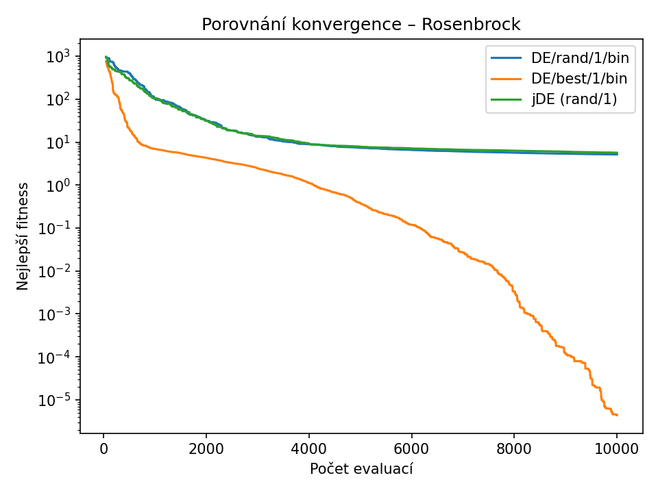
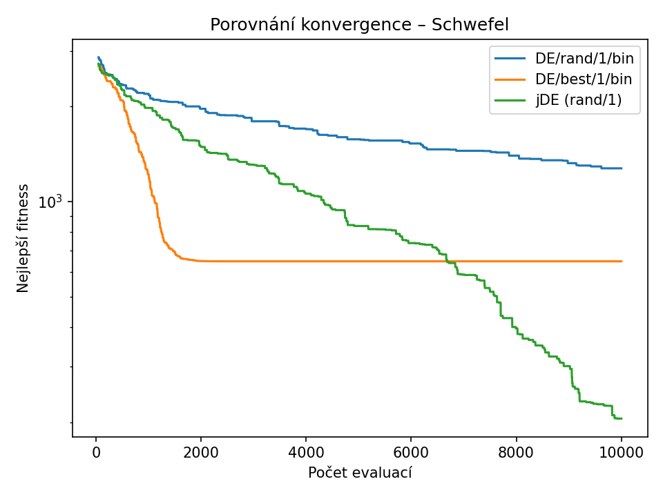

# Souhrnný report diferenciální evoluce (DE)
**Datum generování:** 2025-10-29 21:56:42

## Nastavení experimentu
- Počet běhů = `10`
- Dimenze (D) = `10`
- Počet evaluací = `10000`
- Velikost populace = `50`

## Princip fungování DE
Diferenciální evoluce (DE) pracuje s reálnými vektory. Každý jedinec představuje řešení a nové kandidáty vytváří kombinací jiných jedinců. Hlavní části algoritmu jsou:

- **Mutace:** vytváří tzv. *mutantní vektor*. Např. pro strategii `rand/1` platí:
  \\( v_i = x_{r1} + F (x_{r2} - x_{r3}) \)
  kde `F` (0.5–0.9) určuje velikost kroku.
- **Křížení (crossover):** kombinuje mutantní vektor s původním jedincem podle pravděpodobnosti `CR`.
- **Selekce:** pokud je nový jedinec lepší, nahradí původního.
- **jDE:** speciální varianta, která si sama adaptuje parametry `F` a `CR`.

## Testovací funkce a jejich rozsahy
| Funkce | Rozsah proměnných |
| --- | --- |
| Sphere | -100 až 100 |
| Rastrigin | -5.12 až 5.12 |
| Rosenbrock | -2.048 až 2.048 |
| Schwefel | -500 až 500 |

## Sphere
### sphere – D=10, budget=10000, runs=10

| Varianta | best | worst | mean | std |
|-----------|-------|-------|------|------|
| DE/rand/1/bin | 9.381e-06 | 6.735e-05 | 3.575e-05 | 1.791e-05 |
| DE/best/1/bin | 7.715e-36 | 3.280e-33 | 6.499e-34 | 9.852e-34 |
| jDE (rand/1) | 1.084e-05 | 3.715e-05 | 1.833e-05 | 7.924e-06 |

## Rastrigin
### rastrigin – D=10, budget=10000, runs=10

| Varianta | best | worst | mean | std |
|-----------|-------|-------|------|------|
| DE/rand/1/bin | 2.555e+01 | 3.767e+01 | 3.214e+01 | 4.166e+00 |
| DE/best/1/bin | 3.980e+00 | 1.691e+01 | 1.264e+01 | 4.006e+00 |
| jDE (rand/1) | 5.937e+00 | 1.132e+01 | 8.254e+00 | 1.611e+00 |

## Rosenbrock
### rosenbrock – D=10, budget=10000, runs=10

| Varianta | best | worst | mean | std |
|-----------|-------|-------|------|------|
| DE/rand/1/bin | 3.673e+00 | 6.236e+00 | 5.163e+00 | 7.110e-01 |
| DE/best/1/bin | 9.954e-12 | 3.654e-05 | 4.372e-06 | 1.093e-05 |
| jDE (rand/1) | 4.217e+00 | 6.514e+00 | 5.660e+00 | 6.524e-01 |

## Schwefel
### schwefel – D=10, budget=10000, runs=10

| Varianta | best | worst | mean | std |
|-----------|-------|-------|------|------|
| DE/rand/1/bin | 8.064e+02 | 1.514e+03 | 1.274e+03 | 1.945e+02 |
| DE/best/1/bin | 1.184e+02 | 1.051e+03 | 6.469e+02 | 2.855e+02 |
| jDE (rand/1) | 4.364e+01 | 3.916e+02 | 2.055e+02 | 1.094e+02 |

---
## Závěr
Ze všech funkcí je vidět, že strategie **DE/best/1/bin** má nejrychlejší konvergenci, ale může uvíznout v lokálním minimu. **DE/rand/1/bin** je stabilnější, i když pomalejší. Varianta **jDE** bývá nejrobustnější, protože si průběžně upravuje parametry F a CR.

Na jednoduché funkci Sphere všechny metody dosáhly téměř nulové chyby. Na Rastriginu se nejlépe projevila jDE. U Rosenbrocka byla nejpřesnější metoda best/1, zatímco u Schwefelu se jDE podařilo lépe překonat lokální minima.
