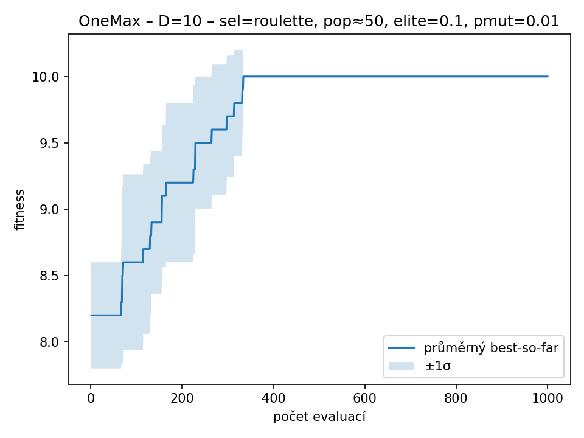
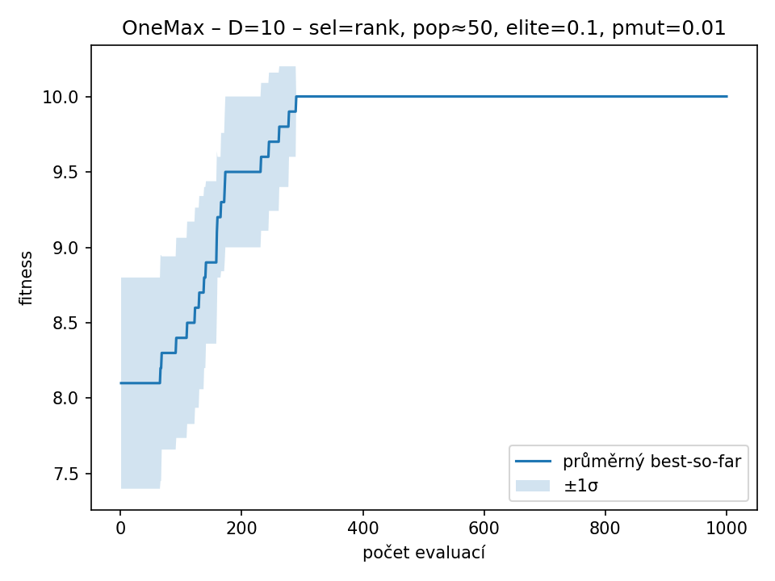
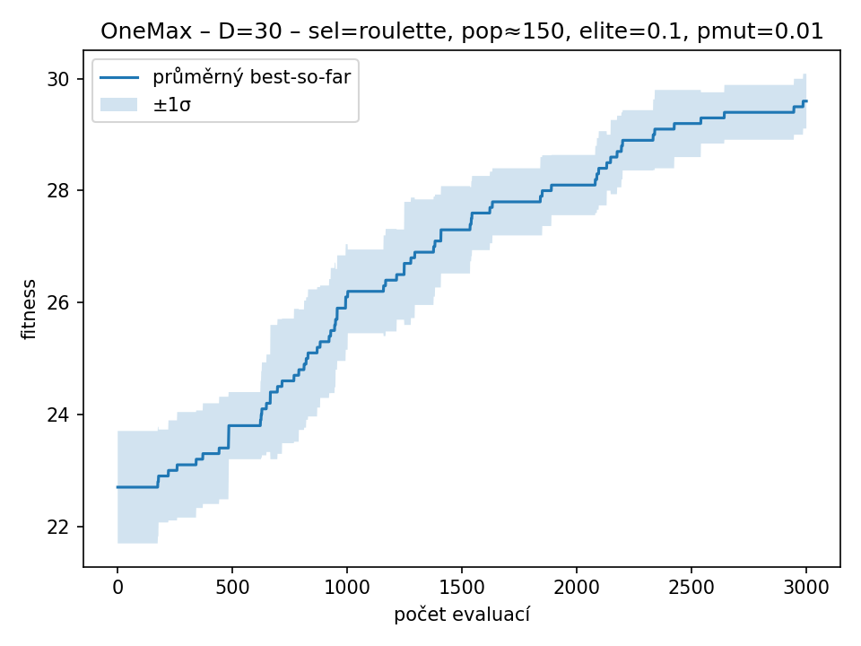
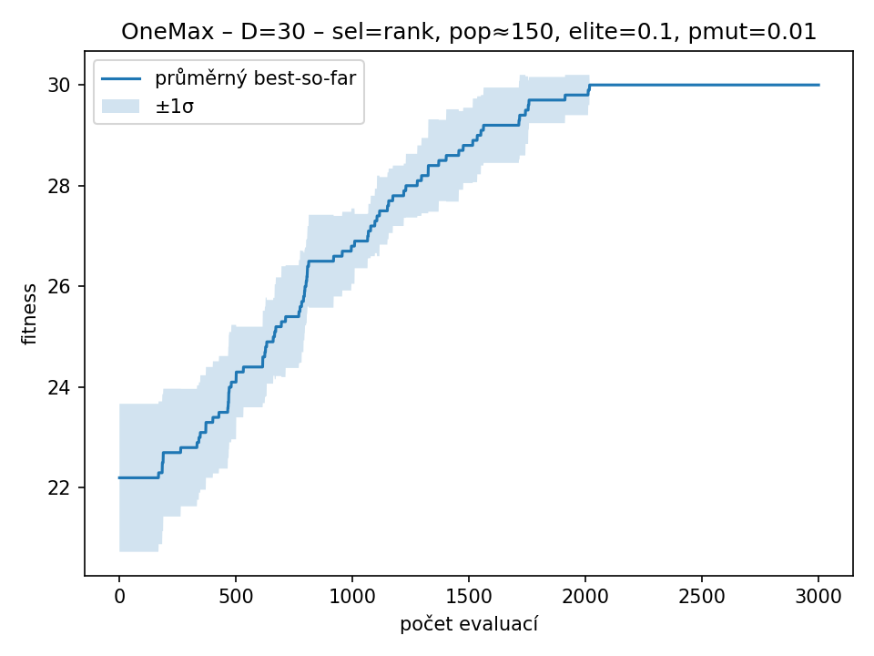
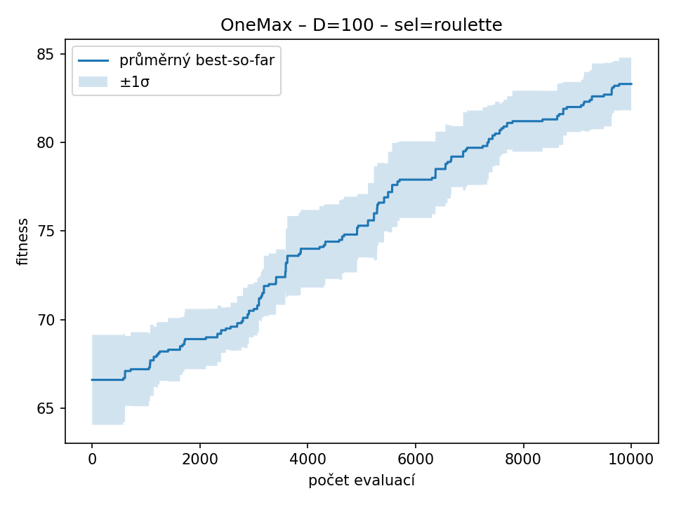
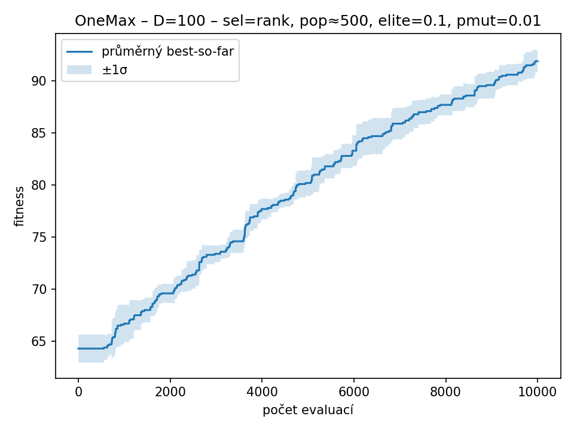
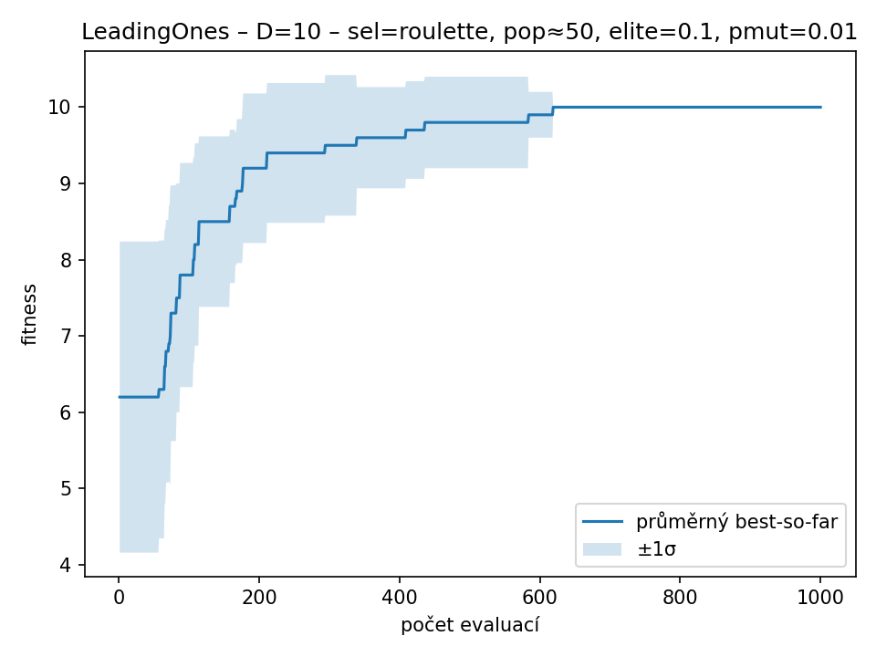
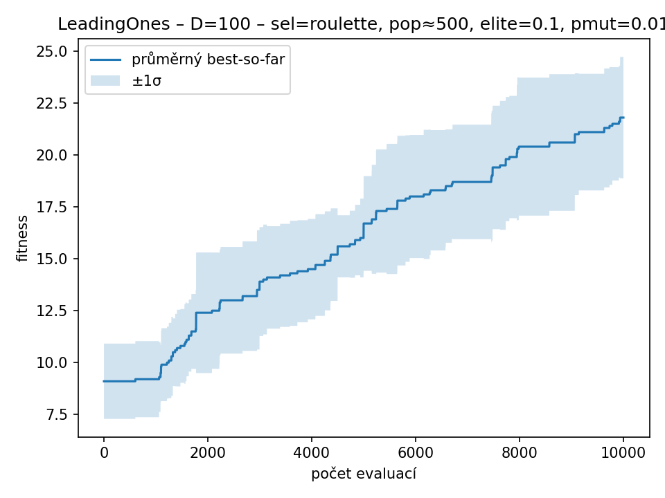
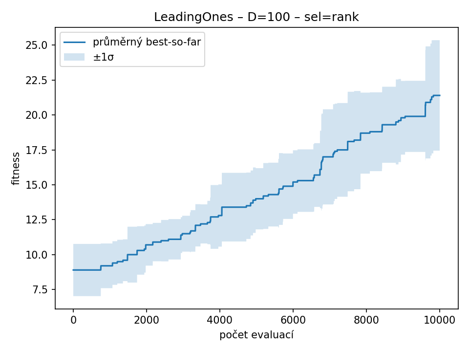

# Genetický algoritmus

---

## Nastavení experimentu

- Počet běhů na kombinaci: **10**
- Rozpočet na běh: **100×D** ( 10: **1000** evaluací, 30: **3000** evaluací, 100: **10000** evaluací )
- Problémy: **onemax**, **leading_ones**

---

## Výsledky – onemax

### onemax – D=10

| Selekce | best | worst | mean | median | std |
|---------|------|-------|------|--------|-----|
| roulette | 10.00 | 10.00 | 10.00 | 10.00 | 0.00 |
| rank | 10.00 | 10.00 | 10.00 | 10.00 | 0.00 |

| roulette | rank |
| --- | --- |
|  |  |

### onemax – D=30

| Selekce | best | worst | mean | median | std |
|---------|------|-------|------|--------|-----|
| roulette | 30.00 | 29.00 | 29.60 | 30.00 | 0.52 |
| rank | 30.00 | 30.00 | 30.00 | 30.00 | 0.00 |

| roulette | rank |
| --- | --- |
|  |  |

### onemax – D=100

| Selekce | best | worst | mean | median | std |
|---------|------|-------|------|--------|-----|
| roulette | 87.00 | 81.00 | 83.90 | 83.50 | 1.85 |
| rank | 94.00 | 90.00 | 91.90 | 92.00 | 1.10 |

| roulette | rank |
| --- | --- |
|  |  |

---

## Výsledky – leading_ones

### leading_ones – D=10

| Selekce | best | worst | mean | median | std |
|---------|------|-------|------|--------|-----|
| roulette | 10.00 | 10.00 | 10.00 | 10.00 | 0.00 |
| rank | 10.00 | 10.00 | 10.00 | 10.00 | 0.00 |

| roulette | rank |
| --- | --- |
|  |  |

### leading_ones – D=30

| Selekce | best | worst | mean | median | std |
|---------|------|-------|------|--------|-----|
| roulette | 23.00 | 13.00 | 17.90 | 18.50 | 3.35 |
| rank | 27.00 | 14.00 | 20.70 | 21.50 | 3.92 |

| roulette | rank |
| --- | --- |
|  |  |

### leading_ones – D=100

| Selekce | best | worst | mean | median | std |
|---------|------|-------|------|--------|-----|
| roulette | 26.00 | 16.00 | 21.50 | 21.00 | 2.92 |
| rank | 29.00 | 18.00 | 22.30 | 21.00 | 3.40 |

| roulette | rank |
| --- | --- |
|  |  |

---

## Závěr

V rámci úkolu byl vytvořen genetický algoritmus, který pracuje s binární reprezentací a využívá elitismus, ruletovou a pořadovou selekci, jednobodové křížení a bitovou mutaci.

Algoritmus byl otestován na dvou úlohách – **OneMax** a **LeadingOnes** – pro délky řetězce 10, 30 a 100. Každý experiment byl proveden desetkrát a výsledky byly vyhodnoceny pomocí konvergenčních grafů a základních statistických ukazatelů (nejlepší, nejhorší, průměrná a mediánová hodnota, směrodatná odchylka).

Výsledky ukázaly, že genetický algoritmus dokáže spolehlivě nacházet optimální řešení v daném rozpočtu evaluací. Elitismus pomohl udržovat kvalitní jedince v populaci a urychlil dosažení maxima. Ruletová selekce fungovala dobře u jednodušší úlohy OneMax, zatímco pořadová selekce se ukázala jako stabilnější u LeadingOnes, kde absolutní rozdíly ve fitness nejsou tak výrazné.

