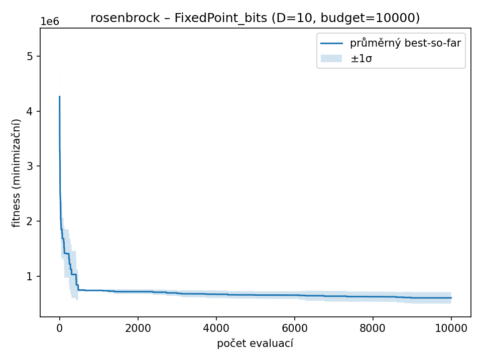
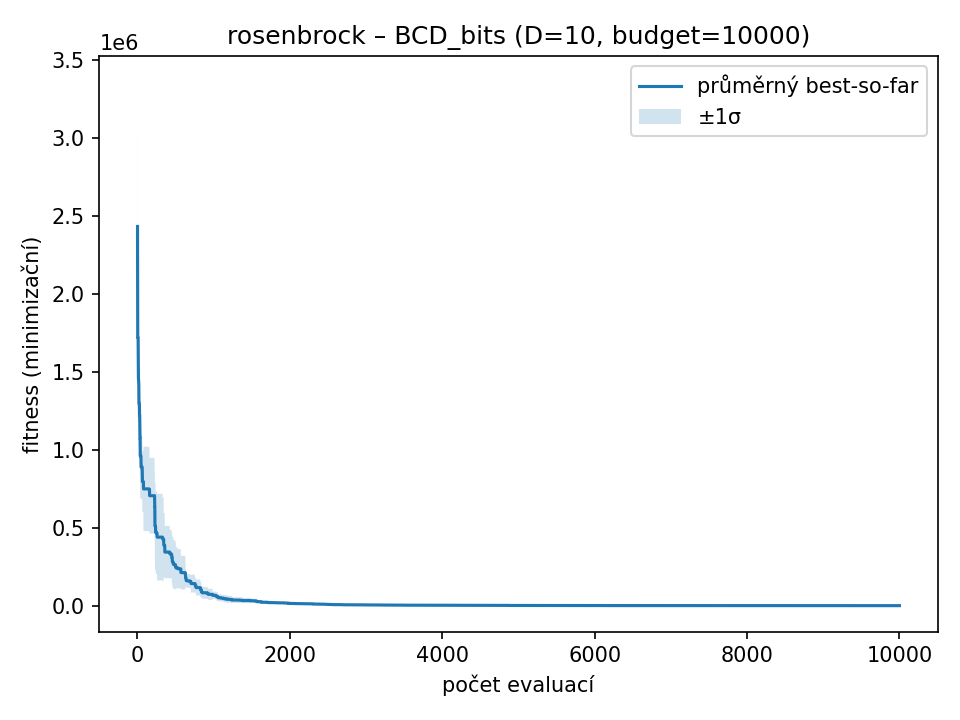
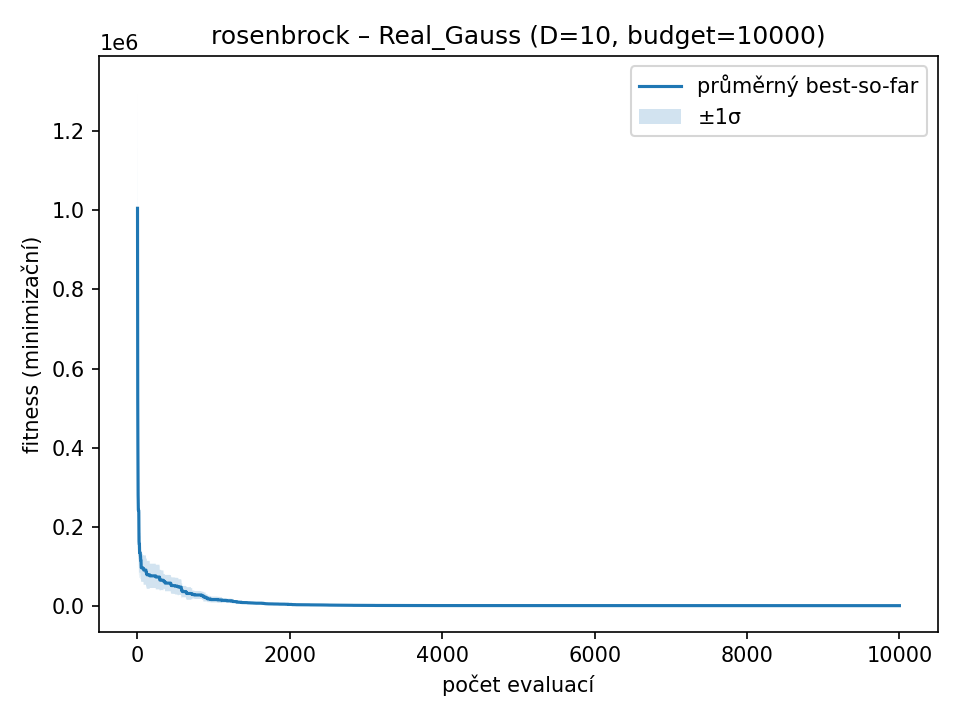
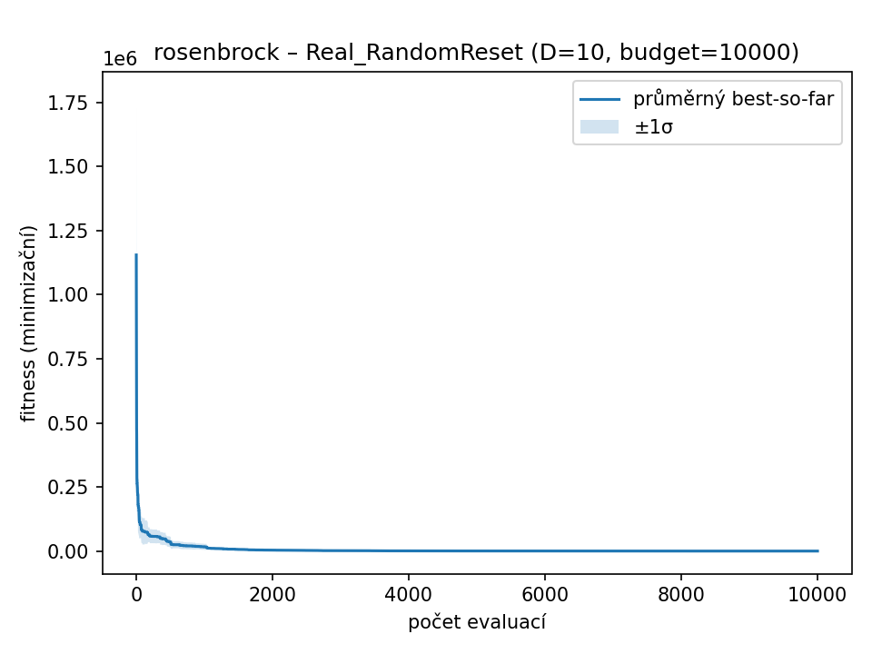

### rosenbrock – D=10, budget=10000, runs=10

| Varianta | best | worst | mean | median | std |
|-----------|-------|-------|------|--------|------|
| **IEEE754_bits** | **8.3505** | **8.8165** | **8.6578** | **8.7614** | **0.1969** |
| FixedPoint_bits | 374943.6353 | 742824.0000 | 607951.3262 | 625523.1817 | 105092.5129 |
| BCD_bits | 48.6439 | 273.9253 | 175.3783 | 168.9099 | 60.9190 |
| Real_Gauss | 9.1093 | 27.1451 | 14.0887 | 12.0019 | 5.2516 |
| Real_RandomReset | 30.6240 | 156.0426 | 91.3999 | 92.3007 | 35.3104 |

| IEEE754_bits | FixedPoint_bits | BCD_bits | Real_Gauss | Real_RandomReset |
| --- | --- | --- | --- | --- |
|  |  |  |  |  |
