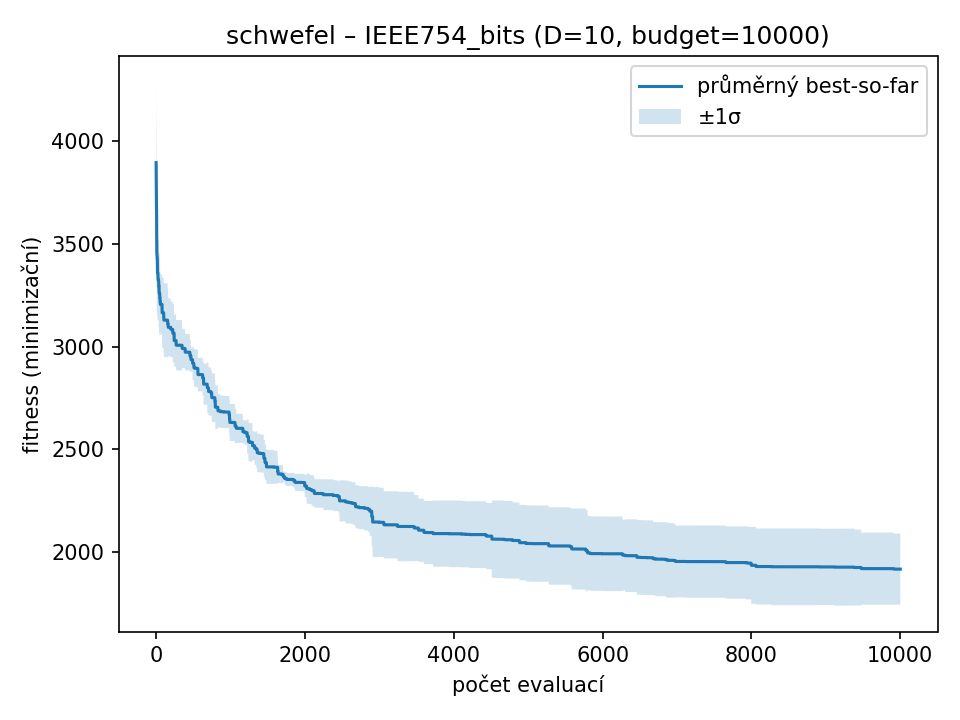
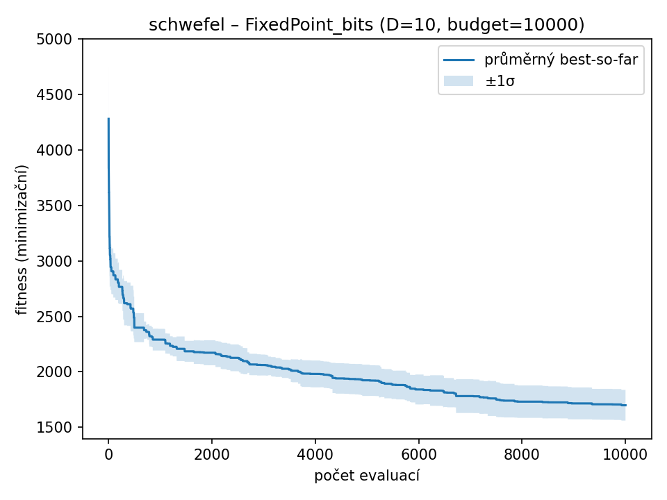
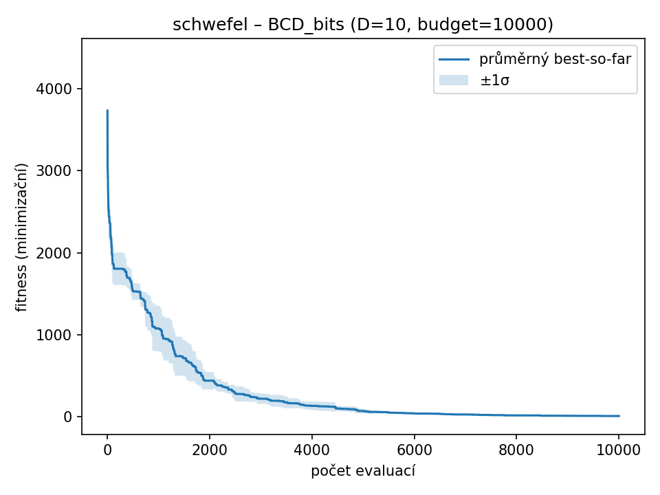
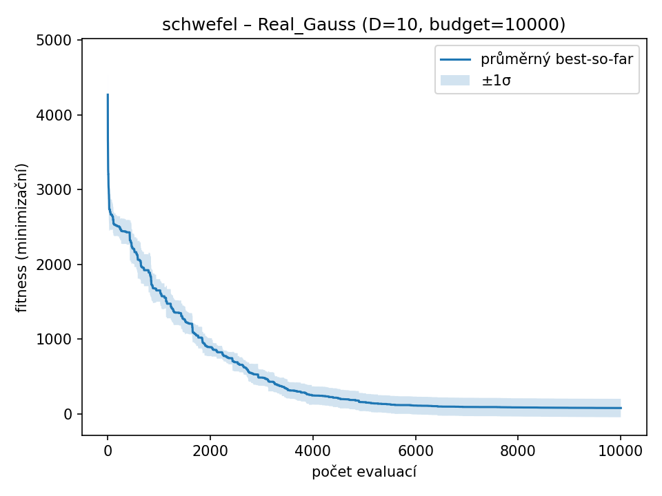
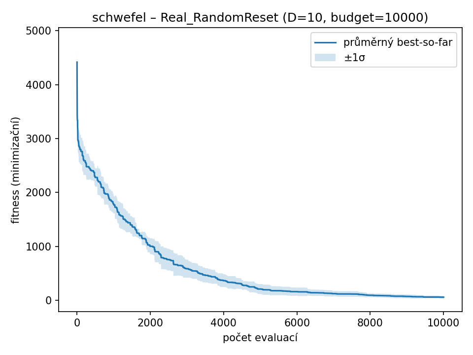

### schwefel – D=10, budget=10000, runs=10

| Varianta | best | worst | mean | median | std |
|-----------|-------|-------|------|--------|------|
| IEEE754_bits | 1609.5940 | 2176.7617 | 1918.7108 | 1914.4968 | 172.4852 |
| FixedPoint_bits | 1476.3828 | 1913.2094 | 1697.9429 | 1683.9743 | 138.3659 |
| **BCD_bits** | **3.6658** | **17.4658** | **10.0753** | **10.5058** | **4.7065** |
| Real_Gauss | 3.1844 | 369.9057 | 77.9084 | 6.7505 | 123.2230 |
| Real_RandomReset | 13.8739 | 113.1372 | 58.9407 | 61.6960 | 25.2869 |

| IEEE754_bits | FixedPoint_bits | BCD_bits | Real_Gauss | Real_RandomReset |
| --- | --- | --- | --- | --- |
|  |  |  |  |  |
