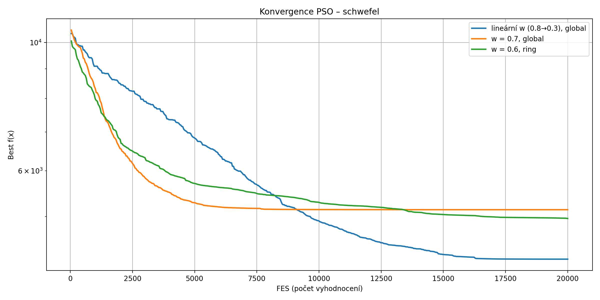
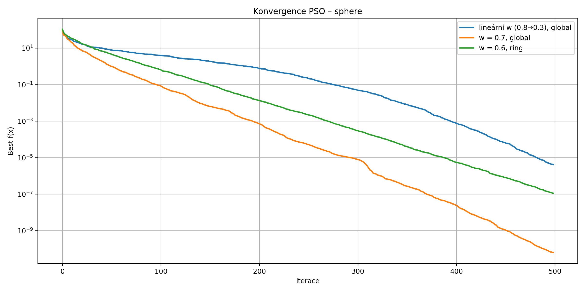

# PSO Benchmark – Protokol

## Zadání

Otestujte tři varianty algoritmu PSO na vybraných testovacích funkcích:

- Lineární setrvačnost: **w = 0.8 → 0.3**, c1 = 2, c2 = 2, globální topologie (hvězda)
- Konstantní setrvačnost: **w = 0.7**, c1 = c2 = 1.49618, globální topologie
- Konstantní setrvačnost: **w = 0.6**, c1 = c2 = 1.49618, kruhová topologie (sousedství 2)

Parametry:
- Velikost populace: 40
- MAXFES: 20 000
- vmax = 0.2 * (upper - lower)
- Částice se mohou volně pohybovat i mimo prostor hledání.
  Hodnoty mimo bounds jsou ohodnoceny jako **+inf**.
- Nepoužívá se boundary-clipping.
- Během každé varianty je provedeno **10 běhů**, z nichž se počítá průměrná konvergenční křivka a statistiky výsledků.

## Parametry PSO variant

| Varianta | w | c1 | c2 | Topologie |
|----------|----|------|------|-------------|
| Lineární w | 0.8 → 0.3 | 2.0 | 2.0 | global |
| Konstantní w | 0.7 | 1.49618 | 1.49618 | global |
| Konstantní w | 0.6 | 1.49618 | 1.49618 | ring (2 sousedé) |

---

## Výsledky

### Rosenbrock

| Varianta | Best | Worst | Mean | Median | Std |
|----------|------|-------|------|--------|------|
| lineární w (0.8→0.3) – global | 2.230398e+01 | 2.135381e+02 | 8.233964e+01 | 7.976434e+01 | 6.208948e+01 |
| w = 0.7 – global | 1.551960e+01 | 8.092413e+01 | 5.357909e+01 | 7.259309e+01 | 2.759700e+01 |
| **w = 0.6 – ring** | **2.969844e+00** | **7.290655e+01** | **3.332894e+01** | **2.231077e+01** | **2.828673e+01** |

#### Interpretace výsledků

- Rosenbrockova funkce obsahuje úzké zakřivené údolí.
- Ring topologie udržuje diverzitu a zabraňuje předčasné konvergenci.
- **Výsledky odpovídají teorii — ring PSO dominuje.**

---

### Schwefel

| Varianta | Best | Worst | Mean | Median | Std |
|----------|------|-------|------|--------|------|
| **lineární w (0.8→0.3) – global** | **3.296770e+03** | **5.290366e+03** | **4.220529e+03** | **4.224579e+03** | **5.720900e+02** |
| w = 0.7 – global | 4.224607e+03 | 5.922164e+03 | 5.138693e+03 | 5.251288e+03 | 5.214974e+02 |
| w = 0.6 – ring | 4.138738e+03 | 5.695368e+03 | 4.961967e+03 | 4.964648e+03 | 4.280618e+02 |

#### Interpretace výsledků

- Schwefel je extrémně multimodální funkce s mnoha lokálními minimy.
- Lineární setrvačnost poskytuje agresivní exploraci na začátku.
- **Proto lineární varianta dosáhla nejlepších výsledků.**

---

### Sphere

| Varianta | Best | Worst | Mean | Median | Std |
|----------|------|-------|------|--------|------|
| lineární w (0.8→0.3) – global | 1.637713e-07 | 8.496366e-06 | 2.554926e-06 | 1.886138e-06 | 2.219346e-06 |
| **w = 0.7 – global** | **3.423642e-12** | **2.630296e-08** | **3.383518e-09** | **3.667604e-10** | **7.710990e-09** |
| w = 0.6 – ring | 3.308520e-08 | 1.184320e-07 | 7.404316e-08 | 6.459823e-08 | 2.966174e-08 |

#### Interpretace výsledků

- Sphere je jednoduchá unimodální funkce.
- Nejlepší výkon má stabilní nastavení bez velkých výkyvů.
- **Konstantní w = 0.7 global je očekávaně nejlepší.**

---

## Celkové zhodnocení

- Každá varianta zvítězila na jedné testovací funkci.

- **Dominance variant závisí na charakteru funkce.**

- Výskyt vítězů: `{'w = 0.6 – ring': 1, 'lineární w (0.8→0.3) – global': 1, 'w = 0.7 – global': 1}`

### Shrnutí chování PSO variací

- Lineární setrvačnost exceluje v multimodálních prostorech.
- Konstantní w = 0.7 je nejlepší v hladkých unimodálních funkcích.
- Ring topologie přináší diverzitu a je vhodná pro funkce s úzkými 'údolími'.
